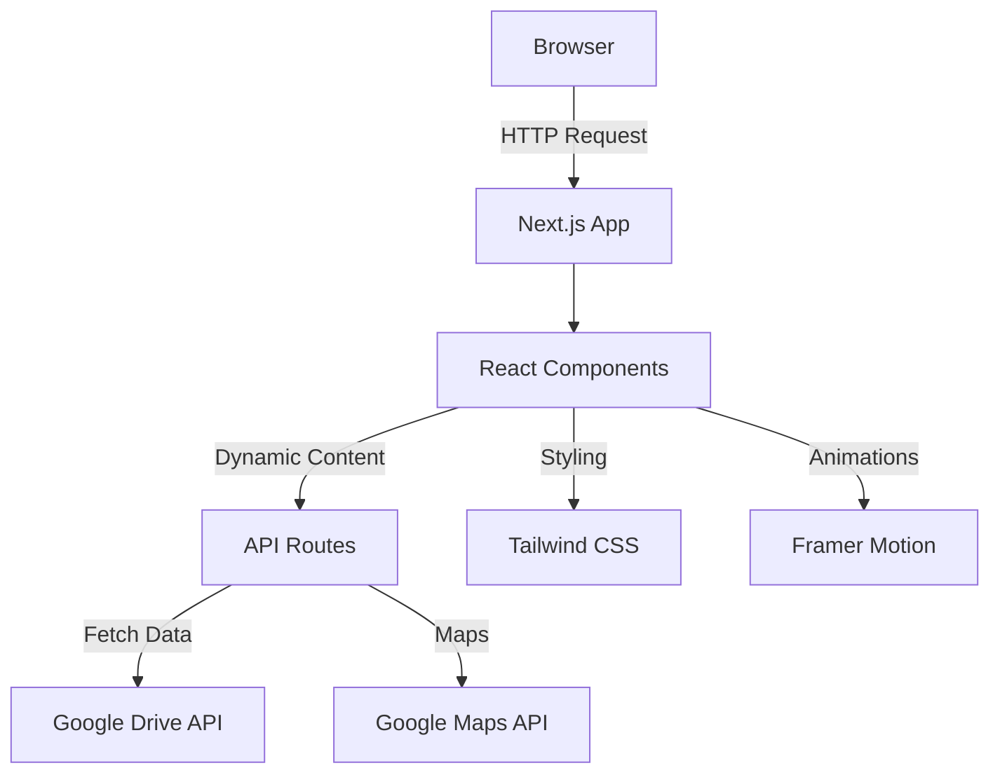
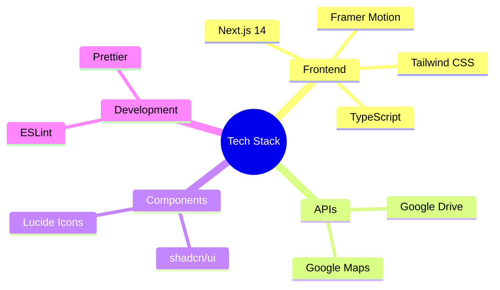

# 🏃‍♂️ Abujhmad Marathon 2025

<div align="center">

[](https://nextjs.org/)
[](https://www.typescriptlang.org/)
[](https://tailwindcss.com/)
[](LICENSE)

An elegant website for the Abujhmad Peace Marathon 2025 built with modern web technologies.

[View Demo](your-demo-link) · [Report Bug](your-issues-link) · [Request Feature](your-issues-link)

</div>

## 🌟 Overview

The Abujhmad Marathon website serves as a digital platform for one of India's most scenic marathon events. Built with cutting-edge technologies, it offers a seamless experience for participants, spectators, and organizers.

## 🏗️ Architecture



## ✨ Features

- 🎨 **Modern Design** - Sleek UI with fluid animations
- 📱 **Responsive Layout** - Perfect viewing on all devices
- 🗺️ **Interactive Maps** - Real-time track visualization
- 🖼️ **Dynamic Media Gallery** - Auto-updating image carousel
- 📅 **Event Registration** - Streamlined signup process
- 🔄 **Social Integration** - Connected with all platforms

## 🚀 Quick Start

```bash
# Clone the repository
git clone https://github.com/yourusername/marathon-website.git

# Install dependencies
cd marathon-website
npm install

# Start development server
npm run dev
```

## 🛠️ Tech Stack



## 📂 Project Structure

```
marathon-website/
├── app/                # Next.js App Router
├── components/         # React Components
│   ├── ui/            # shadcn/ui components
│   └── ...            # Custom components
├── lib/               # Utility functions
├── public/            # Static assets
└── styles/           # Global styles
```

## 🖥️ Environment Setup

1. Create a `.env.local` file:
```env
NEXT_PUBLIC_GOOGLE_MAPS_API_KEY=your_api_key
GOOGLE_DRIVE_API_KEY=your_api_key
```

2. Configure Google APIs:
   - Enable Google Maps API
   - Enable Google Drive API
   - Set up OAuth credentials

## 🤝 Contributing

Contributions are welcome! Please follow these steps:

1. Fork the repository
2. Create a feature branch (`git checkout -b feature/AmazingFeature`)
3. Commit changes (`git commit -m 'Add AmazingFeature'`)
4. Push to branch (`git push origin feature/AmazingFeature`)
5. Open a Pull Request

## 📄 License

This project is licensed under the MIT License - see the [LICENSE](LICENSE) file for details.

## 👥 Team

- **Project Lead**: [Your Name](your-profile-link)
- **Design**: [Designer Name](designer-profile-link)
- **Development**: [Developer Name](developer-profile-link)

## 🙏 Acknowledgments

Special thanks to:
- Narayanpur Police for their support
- District Administration
- All our sponsors and partners

<div align="center">
Made with ❤️ for Abujhmad Marathon 2025
</div>
